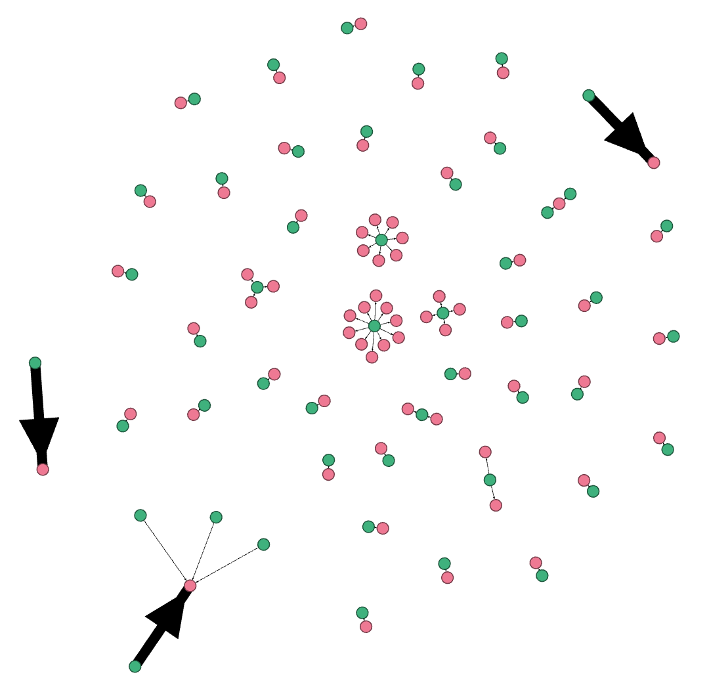

## Full Disclosure Social Network

Meta data for node & edge list in Gephi: Link to Mega folder: https://mega.nz/#F!CUEByR5I!GY56GzTpYz68IlTqj4aQNQ

### Author-Thread

The `fd_threads_header_to_author_thread.R` script uses the `threads_header.csv` generated by `fd_to_threads.py` to create a node and edgelist table suitable for visualization in [Gephi](https://gephi.org/) or any other Network Analysis package (e.g. NetworkX or igraph). The script also provide colored labels to identify authors (green) and threads (red), weighted edges (reflected in their size on Gephi) to display author number of replies to a given thread, and direct url to the reply on full disclosure website, as shown below:



Visualizing the mailing list as a network can help visualize patterns, even on low traffic months, as shown below for the month of May 2016. For instance, we can quickly identify two kind of list subscribers on May 2016: Those who post a number of advisory threads (green nodes surrounded by red nodes), and those who actually lead a conversation on the mailing list (red nodes surrounded by green nodes). Finally, 2 unusual cases also appears in May 2016, where 2 authors appears to be talking to themselves (in reality, they are trying to complement their original reply). 

#### How to Use

To execute the script for author-thread, run:

```
Rscript fd_threads_header_to_author_thread.R <folder filepath containing reply headers .csv from fd_crawler.R> <output file path>
```

###Other Networks 

The author-thread network is just the tip of the iceberg. It is work in progress making available other networks our group currently has investigated, such as extracted n-grams from the e-mail thread body. Some of this data is available on the mega url above.  