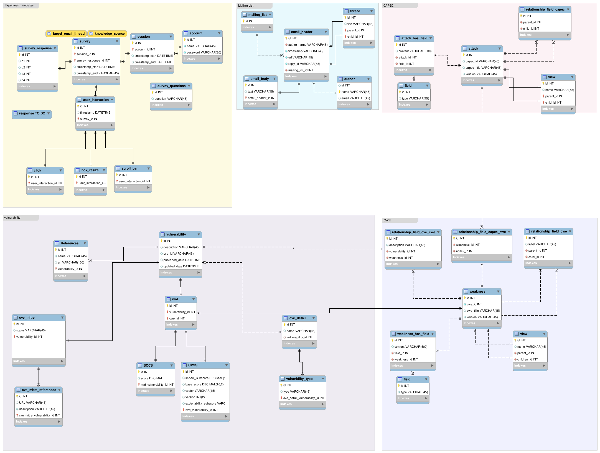
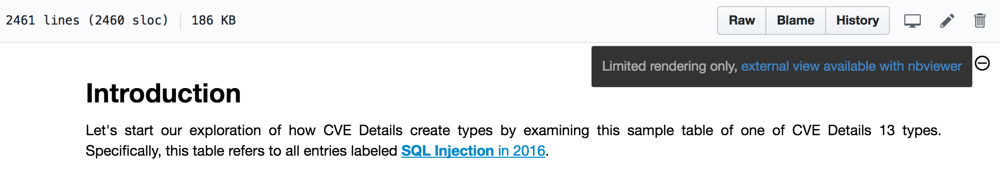

# Data Model

This data model presents a overview of relevant data analyzed by our group from:

 - Mailing lists
 - Knowledge Sources
   - Vulnerabilities
     - CVE Mitre
     - NVD
     - CVE Details
   - Attack Patterns
     - CAPEC
   - Weaknesses
     - CWE

It also presents a working in progress website database that builds on top
of the data model for experiments concerning validation of our tools.

For CWE and CAPEC, the relationships are contained into **fields**, however
they have been explicited as separate tables to ensure foreign key constraints.
This makes explicit a rich relationship among the knowledge sources which is
not apriori visible directly through the data sources.

TODO: We believe CVE's Vulnerabilities contains, within it's references, links
to CWE (and maybe CAPEC), however heavier pre-processing is required. For an
early discussion on the references of vulnerabilities, see [CVE Mitre Notebook](https://github.com/sailuh/perceive/blob/master/Notebooks/CVE_Mitre/cve_mitre_introduction.ipynb).

For more details on the rationale behind the schema design, see conclusions
and assumptions of each respective source as shown on the associated Notebooks:

- [NVD Notebook](https://github.com/sailuh/perceive/blob/master/Notebooks/NVD/nvd_introduction.ipynb)
- [CVE Details Notebook](https://github.com/sailuh/perceive/blob/master/Notebooks/CVE_Details/cve_details_introduction.ipynb)
- [CAPEC Notebook](https://github.com/sailuh/perceive/blob/master/Notebooks/CAPEC/capec_introduction.ipynb)
- [CWE Notebook]()
- [Mailing List Full Disclosure Notebook](https://github.com/sailuh/perceive/blob/master/Notebooks/Full_Disclosure/full_disclosure_introduction.ipynb)

Please make sure you select to display the Notebook with plot by accessing NBViewer if prompted to do so. The image below shows where the button is located to obtain the hyperlink to NBViewer.

A Notebook on how data is populated will be submitted soon.
