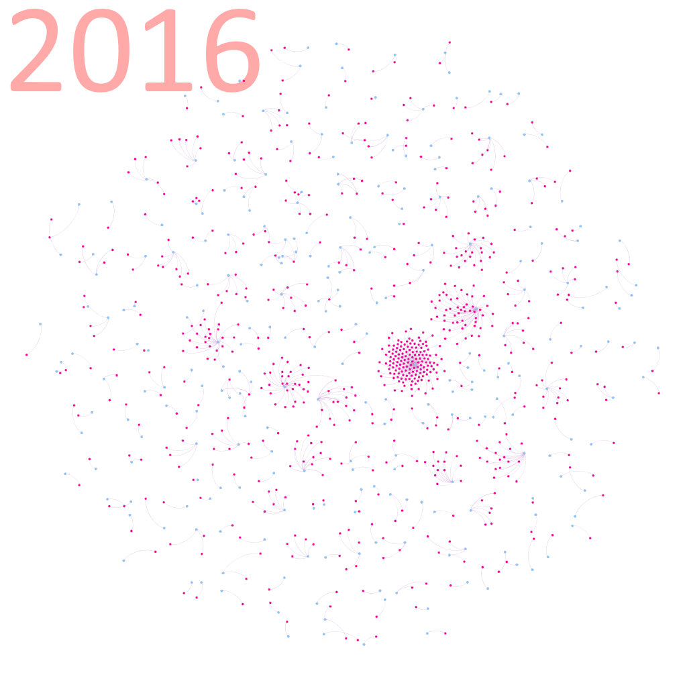
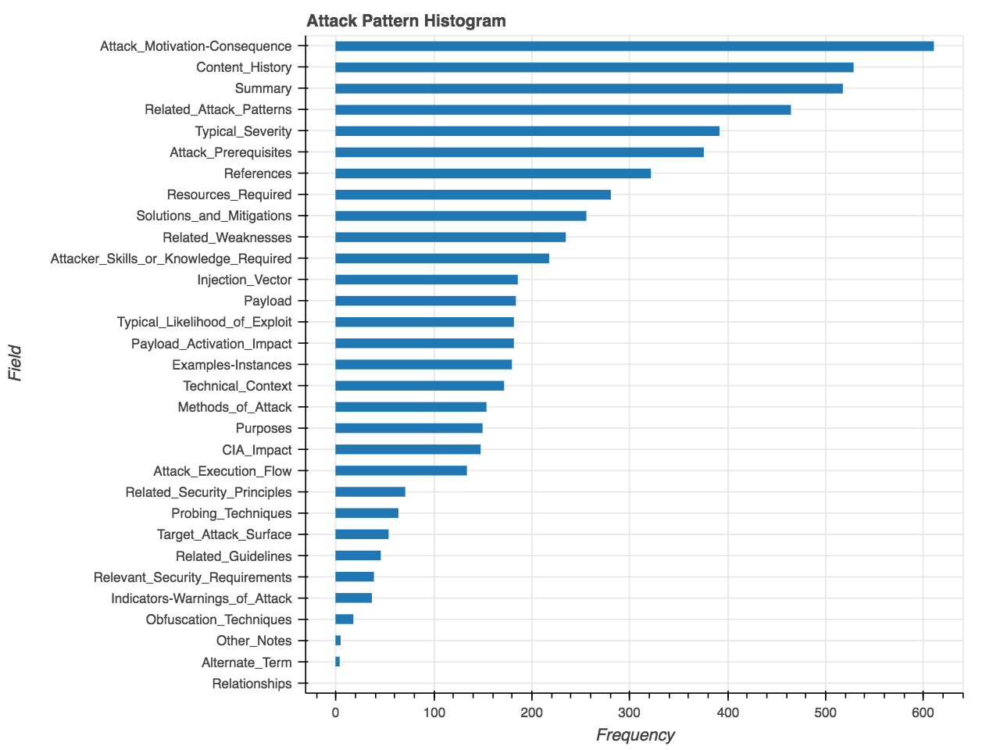
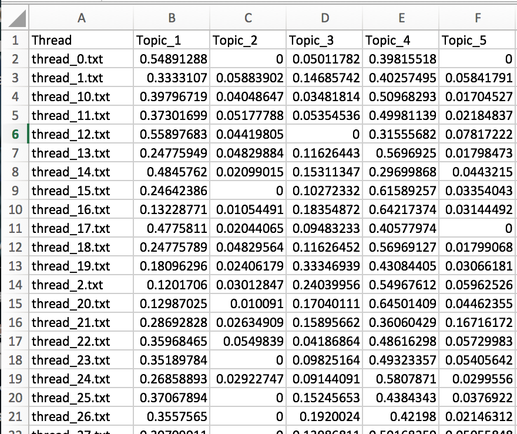
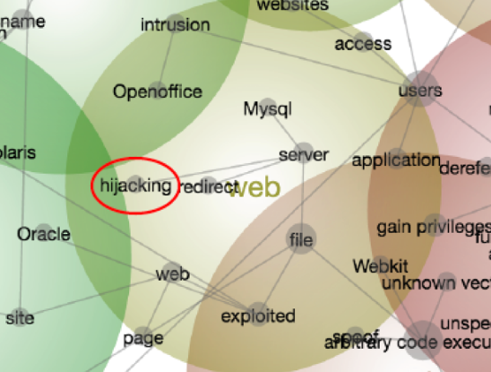

# Introduction 

The cybersecurity community typically reacts to attacks after they occur. Being reactive is costly and can be fatal where attacks threaten lives, important data, or mission success. But can cybersecurity be done proactively?

# Our Group 

We are currently prototyping some tools to investigate how far ahead we can identify upcoming threats, using social network analysis and text mining. 

# Getting Started

Here are some of the things you can do with what is available in our github:

## Social Network Analysis

Explore social network patterns in seclists.org:

## Knowledge Source

Explore CAPEC from a data lens to gain insight on selecting words for corpus creation: 

## Text Mining

Investigate knowledge sources similarity to ongoing discussion in mailing lists:

 

or by using our scripts in combination with other tools:

 

# Contact Us

Feel free to contact us if you are interested in colaborating! 
