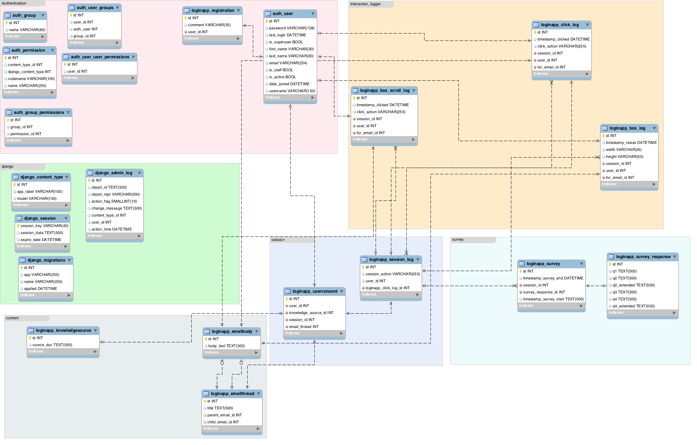

# Data Model

The main components of the data model are:

- session
- content
- survey
- interaction_logger

Additionally, django components which are not discussed here:

- authentication (relevant table: `auth_user`)
- django

## session

Every user (`auth_user`) when logged in is associated to a session (`loginapp_session_log`),
and then presented with one e-mail thread (`loginapp_emailbody`), one knowledge source entry (`loginapp_knowledgesource`), and one fixed survey (`loginapp_survey`).

Surveys(`loginapp_survey`) are **always** presented with one e-mail thread (`loginapp_emailbody`) and one knowledge source entry (`loginapp_knowledgesource`), since
the questions are about how the chosen e-mail thread relate to the knowledge source entry. Every time a survey is submitted
within a session, a new e-mail thread (`loginapp_emailbody`) and knowledge source entry (`loginapp_knowledgesource`) is
chosen.

## content

A cybersecurity mailing list threads (`loginapp_emailbody`) and knowledge source entries (`loginapp_knowledgesource`) are
stored in the database and randomly chosen one at a time when every time a survey is displayed.

## survey

The survey currently contain 4 questions assessing how the e-mail thread (`loginapp_emailbody`) relate to the knowledge source `loginapp_knowledgesource`).

## interaction_logger

The selection of e-mail replies within the chosen e-mail thread to open (`loginapp_click_log`), expanded (`loginapp_box_log`) and scrolled  (`logginapp_box_scroll_log`) are logged.
